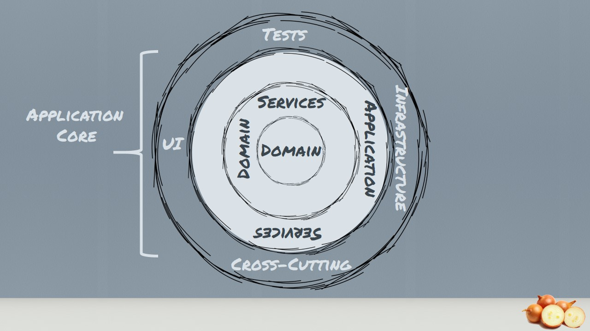

# Solari Wallat

This is a GRPC API designed to solve the problem of Transfers money abroad between Friends to avoid tax and fee, the purpose of it gives more control for the holders and shows how much money they need to have in booth balance's using different currencies. This API is using .Net 5, HostedService, Railway Oriented, Onion Architecture with DDD aproach,  Swagger and Docker.


## Required
- .Net 5

## Assumptions:

- 

## Endpoints
### Deposit


## Railway Oriented

You can find out more about Railway Oriented Programming at http://fsharpforfunandprofit.com/rop, where there are slides and videos that explain the concepts in more detail.

We're CSharpFunctionalExtensions to implemente Railway Oriented

https://github.com/vkhorikov/CSharpFunctionalExtensions

For read more and see exemple

https://github.com/vkhorikov/FuntionalPrinciplesCsharp


## Containerization

Build image 

```
docker build -t SolariWallet:latest
```

Image pushed to Registry

```
docker push SolariWallet:latest
```

Run

```
docker run -it --rm -p 5001:80 SolariWallet --name Wallet
```
Access: http://localhost:5001/Swagger/index.html

## Architecture
- Onion Architecture

<p align="center">

</p>

## Technologies used:

- Railway Oriented with CSharpFunctionalExtensions
- Native .Net Core DI
- Api documentation with Swagger
